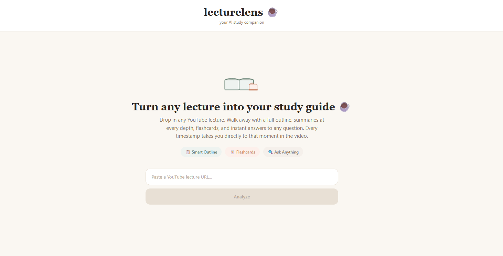
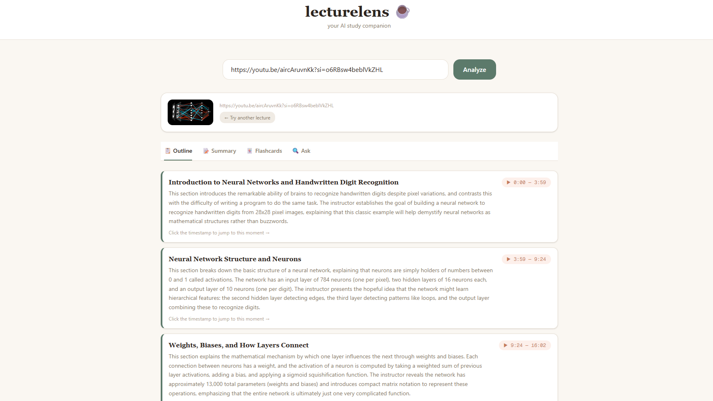
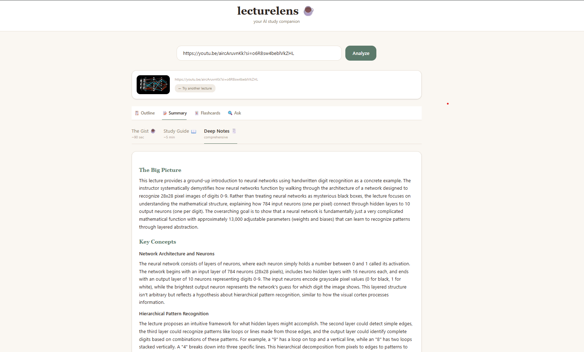
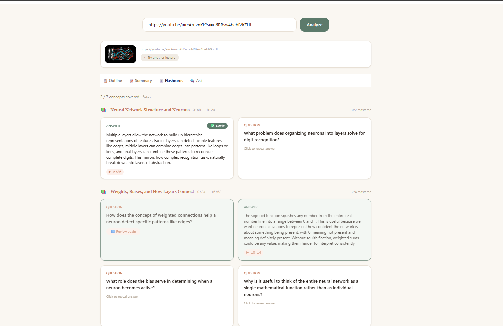
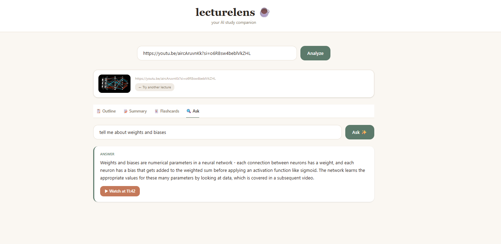
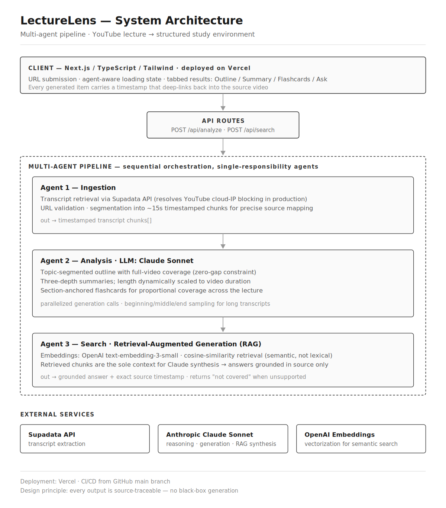

# LectureLens ☕

**Turn any YouTube lecture into a complete study environment: outline, layered summaries, flashcards, and grounded semantic search, all traceable back to the exact moment in the video.**

🔗 **Live demo:**
https://lecture-lens-sand.vercel.app


🎥 **Video walkthrough:** 
https://www.loom.com/share/6392d3f02fe54d54b5790080f483e8d2


---

## The Problem

A huge amount of learning now happens on YouTube: lectures, tutorials, entire courses. But the format is passive. You sit through a two-hour video, forget most of it by the next day, and when you're short on time before an exam there's no efficient way to get to what actually matters. The knowledge is recorded and available, but the value is hard to extract.

LectureLens closes that gap. It turns any lecture into an active study environment where a student can work through an hour of material in roughly fifteen minutes, and actually retain it, because they're engaging with it instead of just watching.

---

## What It Does

- **Timestamped outline.** Topic-driven sections covering the full video with no gaps. Every section deep-links to that exact moment in the lecture.
- **Three-depth summaries.** The Gist (~90s read), Study Guide (revision), and Deep Notes (comprehensive). Length scales automatically with video duration.
- **Section-grouped flashcards.** Generated per outline section for full coverage, with active-recall progress tracking and source timestamps on every answer.
- **Grounded semantic search (Ask).** Ask any question in plain English. The app retrieves the most relevant moments and synthesizes a direct answer that can only draw from the lecture itself.
- **Graceful failure handling.** Private videos, missing captions, and malformed transcripts are handled cleanly rather than crashing.

---

## Screenshots

**Landing: paste any YouTube lecture URL to get started**


**Outline: full-coverage, topic-driven, every section links into the video**


**Summaries: three depths, scaled to video length**


**Flashcards: section-grouped with active-recall progress tracking**


**Ask: grounded answers with an exact source timestamp**


---

## Architecture



LectureLens is built as a multi-agent pipeline. It is not one large prompt, but three distinct agents, each with a single responsibility and a clean handoff to the next.

**Agent 1, Ingestion.** Fetches the transcript, validates the URL, and splits the transcript into roughly 15-second timestamped chunks. Transcript retrieval runs through the Supadata API, which resolves the cloud-IP blocking that YouTube applies to serverless environments.

**Agent 2, Analysis (Claude Sonnet).** Reasons over the chunks to produce the outline, summaries, and flashcards. The outline is constrained to follow topic changes and cover the entire video with no gaps. Summaries scale with video length, and generation is parallelized for reliability.

**Agent 3, Search (RAG).** Converts transcript chunks into vectors using OpenAI embeddings, retrieves the most relevant moments by cosine similarity, and passes only those retrieved chunks to Claude for synthesis. Because the model can only answer from retrieved source material, it resists hallucination and explicitly returns "not covered" when the lecture doesn't address a question.

---

## Tech Stack

| Layer | Choice | Why |
|---|---|---|
| Frontend | Next.js 14, TypeScript, Tailwind CSS | One codebase for UI and API routes. Fast, type-safe, Vercel-native. |
| Reasoning | Anthropic Claude Sonnet | Reliable structured output and instruction-following for generation that feeds directly into the UI. |
| Embeddings | OpenAI text-embedding-3-small | Industry-standard, low-cost semantic vectorization for search. |
| Transcripts | Supadata API | Handles YouTube transcript retrieval reliably from cloud infrastructure. |
| Hosting | Vercel | One-click deploy with continuous deployment from the GitHub main branch. |

---

## The AI Decisions

**Why a multi-agent split.** Ingestion, analysis, and search are fundamentally different jobs: a data pipeline, language generation, and vector retrieval. Separating them means each does what it's good at, and a change to one, such as how search ranks results, doesn't ripple into the others.

**Why RAG for search.** A language model alone will confidently answer questions about content it never saw. Retrieval-augmented generation constrains the model to answer only from retrieved transcript chunks, which makes hallucination structurally difficult. For an educational tool, that grounding is the whole point. An answer you can't trust is worse than no answer.

**Zero-gap outline.** Letting the model freely pick "interesting" moments leaves coverage gaps a student can't see. Anchoring the outline to topic changes with a full-coverage constraint produces a structure the student can actually trust to be complete.

**Dynamic summary scaling.** A 15-minute lecture and a two-hour lecture shouldn't get identically sized summaries. Summary length is scaled to video duration so short lectures aren't padded and long ones aren't flattened.

**Source traceability throughout.** Every outline section, flashcard, and answer carries a timestamp back into the video. Nothing is a black box. The student can always verify a claim against the source.

---

## Reliability and Engineering Challenges

The hardest part of this build was not the AI. It was reliability.

- **YouTube cloud-IP blocking.** Transcript fetching worked perfectly in local development but failed on every video once deployed, because YouTube blocks requests from datacenter IPs. This was diagnosed and resolved by routing transcript retrieval through a dedicated transcript API.
- **Malformed model output.** Long free-text fields returned inside JSON occasionally produced unparseable responses. Summary generation was split into separate, parallelized plain-text calls, and parsing was hardened so a single messy field can't fail the whole request.
- **Long-video handling.** Very long transcripts exceed practical context limits, so summaries sample from the beginning, middle, and end rather than truncating to the start.

---

## Known Limitations

- Requires a public video with available captions. No audio-transcription fallback yet.
- No caching layer. Each analysis runs fresh, so repeat analyses of the same video recompute.
- Timestamps are derived from transcript segmentation and can occasionally be a few seconds off the exact spoken moment.

---

## Future Improvements

- **Response caching** to eliminate repeat latency and cost on previously analyzed videos.
- **Whisper audio-transcription fallback** so caption-less videos still work.
- **Faculty and curriculum-mapping modes:** a private pedagogical audit for instructors, and a multi-lecture coverage map against stated learning objectives.

---

## Running Locally

```bash
git clone https://github.com/avshar15/lecture-lens.git
cd lecture-lens
npm install
cp .env.example .env.local   # add your API keys
npm run dev                  # runs on localhost:3000
```

Requires API keys for Anthropic, OpenAI, and Supadata (see `.env.example`).

---

## Built For

Created for the Cloudforce "No Resume Required" Hackathon, a build challenge to create a multi-agent AI system that unlocks the value of recorded lecture content.
